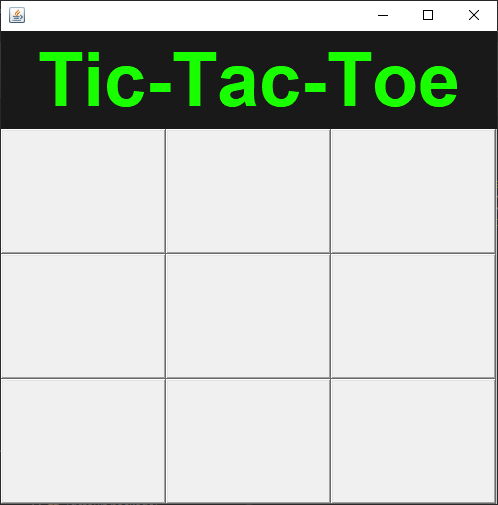

# Tic-tac-toe Game
A very basic Tic-tac-toe game created with Java **AWT**.
This was an University project, So I had to use Java **Applet** according to the project guideline.

## Thank You!
Please ⭐️ this repo and share it with others.

### Screenshots
TicTacToe Window | Window on Winning.
:------------------:|:-------------------
 | 

### Requirements 🔧
* Java version SE 8 or below.

### Installation 🔌
1. Press the **Fork** button (top right the page) to save copy of this project on your account.

2. Download the repository files (project) from the download section or clone this project by typing in the bash the following command:

       git clone 
3. Imported it in Eclipse IDE or any other Java IDE.
4. Run the Game :D

### Contributing 💡
Help others with their project by contributing here and make it better with new ideas, your pull request is very welcomed.
